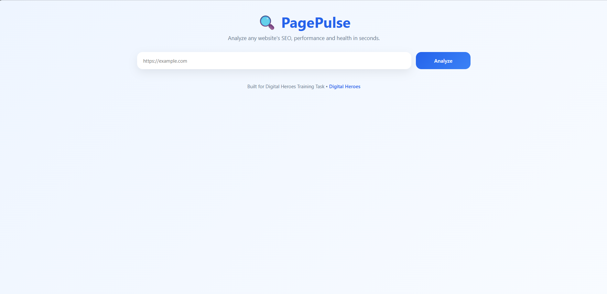
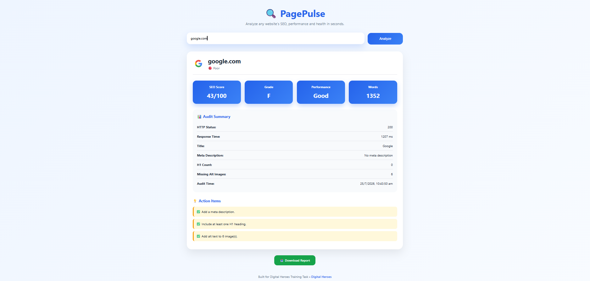
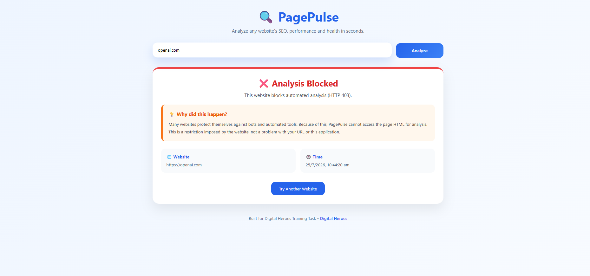

# 🔍 PagePulse

A modern Website SEO & Performance Analyzer built using React, Node.js, and Express.js.

PagePulse analyzes any public webpage and generates an SEO audit report by extracting HTML metadata and evaluating important SEO metrics. The application provides an easy-to-understand dashboard with performance insights, recommendations, and downloadable reports.

---

## 🚀 Live Demo

Frontend: https://page-pulse-sable-three.vercel.app/

Backend API: https://pagepulse-backend-0mmk.onrender.com

---

## 📸 Screenshots

### Home Page



### SEO Report



### Error Handling



---

# ✨ Features

## ✅ Core Features

- Analyze any website by entering its URL
- Fetch webpage HTML using Axios
- Parse HTML using Cheerio
- Extract page title
- Extract meta description
- Count H1 headings
- Detect images without alt text
- Calculate total page word count
- Measure website response time
- Display HTTP response status

---

## ⭐ Advanced Features (Added Beyond Requirements)

### SEO Score

Calculates an overall SEO score out of 100 based on:

- Page title
- Meta description
- Heading structure
- Image accessibility
- Content length
- Website response speed

---

### SEO Grade

Converts the SEO score into an easy-to-read grade.

Example:

- A
- B
- C
- D
- F

---

### Website Health Indicator

Displays overall website quality as:

- 🟢 Excellent
- 🟡 Good
- 🟠 Fair
- 🔴 Poor

---

### Performance Rating

Classifies loading speed into:

- Excellent
- Good
- Average
- Poor

---

### Smart Recommendations

Generates personalized SEO suggestions such as:

- Add a page title
- Add a meta description
- Add missing alt attributes
- Improve page loading speed
- Increase page content
- Use a single H1 heading

---

### Modern Dashboard UI

- Responsive design
- Dashboard cards
- Website favicon
- Professional layout
- Mobile friendly

---

### Download Report

Download the complete SEO audit as a JSON file for future reference.

---

### Robust Error Handling

Handles common errors with descriptive messages:

- Invalid URL
- Website Not Found
- Analysis Blocked (HTTP 403)
- Request Timeout
- Server Error
- Unexpected Errors

Each error includes:

- Error title
- Detailed explanation
- Website entered
- Timestamp

---

# 🛠 Tech Stack

## Frontend

- React
- Axios
- CSS3

## Backend

- Node.js
- Express.js
- Axios
- Cheerio
- CORS
- Dotenv

---

# 📂 Project Structure

```
PagePulse/

├── frontend/

│ ├── components/

│ ├── services/

│ ├── App.jsx

│ └── index.css

│

├── backend/

│ ├── controllers/

│ ├── services/

│ ├── routes/

│ └── server.js

│

└── README.md
```

---

# ⚙ Installation

## Clone Repository

```bash
git clone https://github.com/ajay-02-06/PagePulse
```

---

## Backend

```bash
cd backend

npm install

npm run dev
```

Server runs on:

```
http://localhost:5000
```

---

## Frontend

```bash
cd frontend

npm install

npm run dev
```

Frontend runs on:

```
http://localhost:5173
```

---

# 📊 SEO Metrics Evaluated

- Page Title
- Meta Description
- H1 Count
- Missing Alt Attributes
- Total Word Count
- HTTP Status
- Response Time
- SEO Score
- SEO Grade
- Performance Rating
- Overall Website Health

---

# 🔒 Limitations

Some websites may block automated requests and return HTTP 403.

This is expected behavior and is handled gracefully by the application with a detailed explanation.

---

# 🎯 Future Improvements

- PDF Report Export
- Lighthouse Integration
- Keyword Density Analysis
- Broken Link Detection
- Accessibility Audit
- Mobile SEO Analysis
- SSL Certificate Check
- Sitemap Detection
- Robots.txt Analysis
- Core Web Vitals Integration

---

# 👨‍💻 Developed By

Ajay Kumar

Built as part of the **Digital Heroes Training Task**.